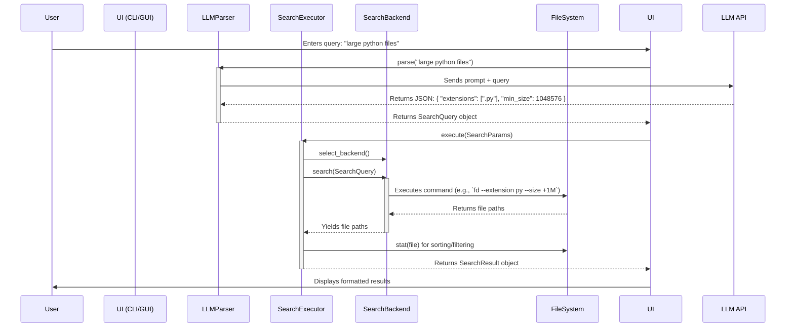

# NL-Find Project Architecture

This document outlines the software architecture of the NL-Find application, including its main components, their interactions, and the overall data flow.

## 1. System Architecture Diagram

The application follows a classic three-layer architecture pattern, separating the user interface, core business logic, and infrastructure services.

```mermaid
graph TD
    subgraph A [User Interface Layer]
        CLI[CLI (Typer)]
        GUI[GUI (PyQt6)]
    end

    subgraph B [Core Engine Layer]
        LLMParser[LLMParser]
        Executor[SearchExecutor]
        Models[Data Models (Pydantic)]
        Backends[Search Backends]
    end

    subgraph C [Infrastructure Layer]
        LLM[LLM Provider API]
        FS[File System]
        Config[Configuration]
    end

    A -- User Input --> B
    B -- Uses --> C

    CLI --> LLMParser
    GUI --> LLMParser
    LLMParser -- SearchQuery --> Executor

    Executor -- Uses --> Backends
    Executor -- Reads/Writes --> FS

    Backends -- Reads --> FS
    LLMParser -- HTTP Request --> LLM
    B -- Reads --> Config
```

- **User Interface Layer**: Provides the entry points for user interaction (CLI and GUI). This layer is responsible for presenting data and capturing user input, but contains no business logic.
- **Core Engine Layer**: The heart of the application. It encapsulates the main business logic: parsing natural language, executing searches, and managing data.
- **Infrastructure Layer**: Provides low-level services, such as interacting with the file system, making API calls to LLM providers, and loading configuration.

---

## 2. Directory Structure

The project is organized into modules with clear responsibilities.

```txt
D:/code/find/
├── src/
│   ├── cli/app.py            # CLI entry point (Typer)
│   ├── config/settings.py      # Configuration models (Pydantic)
│   ├── core/                   # Core application logic
│   │   ├── backends.py         # Search backend implementations (fd, find, etc.)
│   │   ├── executor.py         # Main search execution orchestrator
│   │   ├── llm_parser.py       # Natural language parsing with LLM
│   │   ├── models.py           # Data models (SearchQuery, FileInfo, etc.)
│   │   └── exceptions.py       # Custom exception classes
│   ├── gui/                    # GUI application (PyQt6)
│   │   ├── main_window.py      # Main window and application entry point
│   │   └── widgets/            # Reusable UI components
│   │       ├── dir_tree.py
│   │       ├── file_list.py
│   │       └── search_bar.py
│   └── __main__.py           # Allows running with `python -m src`
│
├── tests/                    # Unit and integration tests
├── docs/                     # Project documentation
├── .env.example              # Example environment file for configuration
├── pyproject.toml            # Project metadata and dependencies (Poetry/PEP 621)
└── README.md
```

---

## 3. Core Components

### `core.models`

- **Purpose**: Defines the data structures used throughout the application.
- **Technology**: Pydantic.
- **Key Models**:
  - `SearchQuery`: The structured output from the `LLMParser`, containing all search criteria.
  - `SearchParams`: Wraps a `SearchQuery` with execution parameters like sorting and limits.
  - `FileInfo`: Represents a single file in the search results.
  - `SearchResult`: The final object returned by the executor, containing results and metadata.

### `core.llm_parser.LLMParser`

- **Purpose**: Converts a user's natural language query into a structured `SearchQuery` object.
- **Process**:
    1. Injects the user's query and current date information into a detailed system prompt.
    2. Sends the prompt to an LLM provider (e.g., OpenAI, Ollama).
    3. Receives a JSON response.
    4. Cleans and validates the JSON data.
    5. Instantiates and returns a `SearchQuery` model.

### `core.executor.SearchExecutor`

- **Purpose**: Orchestrates the file search process.
- **Process**:
    1. Receives `SearchParams`.
    2. Selects the best available `SearchBackend` (e.g., `FdBackend`).
    3. Calls the backend's `search` method to get an initial list of candidate files.
    4. Performs post-filtering in Python for complex criteria not handled by the backend (like content search).
    5. Sorts and limits the results.
    6. Returns a `SearchResult` object.

### `core.backends`

- **Purpose**: Provides concrete implementations for searching the file system.
- **Strategy**: A pluggable system where each backend is a class inheriting from the `SearchBackend` ABC. This allows leveraging fast, native tools.
- **Implementations**: `FdBackend`, `EverythingBackend`, `FindBackend`, `PythonBackend`.

---

## 4. Data Flow

This diagram shows the journey from user input to final results.



---

## 5. GUI Component Architecture

The GUI is built with PyQt6 and follows a standard composite view pattern.

```txt
MainWindow
├── SearchBar          # Search input and LLM toggle
├── QSplitter
│   ├── DirectoryTree  # Left-side directory navigation tree
│   └── FileListWidget # Right-side file results table
└── QStatusBar         # Status messages (e.g., "Searching...", "Ready")
```

- **`MainWindow`**: The top-level window, responsible for layout and connecting signals/slots.
- **`SearchBar`**: Emits a `search_requested` signal when the user initiates a search.
- **`DirectoryTree`**: Allows the user to select the search directory. Emits a `path_selected` signal.
- **`FileListWidget`**: Displays the `FileInfo` objects from a `SearchResult`.
- **`SearchWorker` (QThread)**: Searches are run in a background thread to prevent the UI from freezing. It communicates with the main thread via signals (`finished`, `error`).
